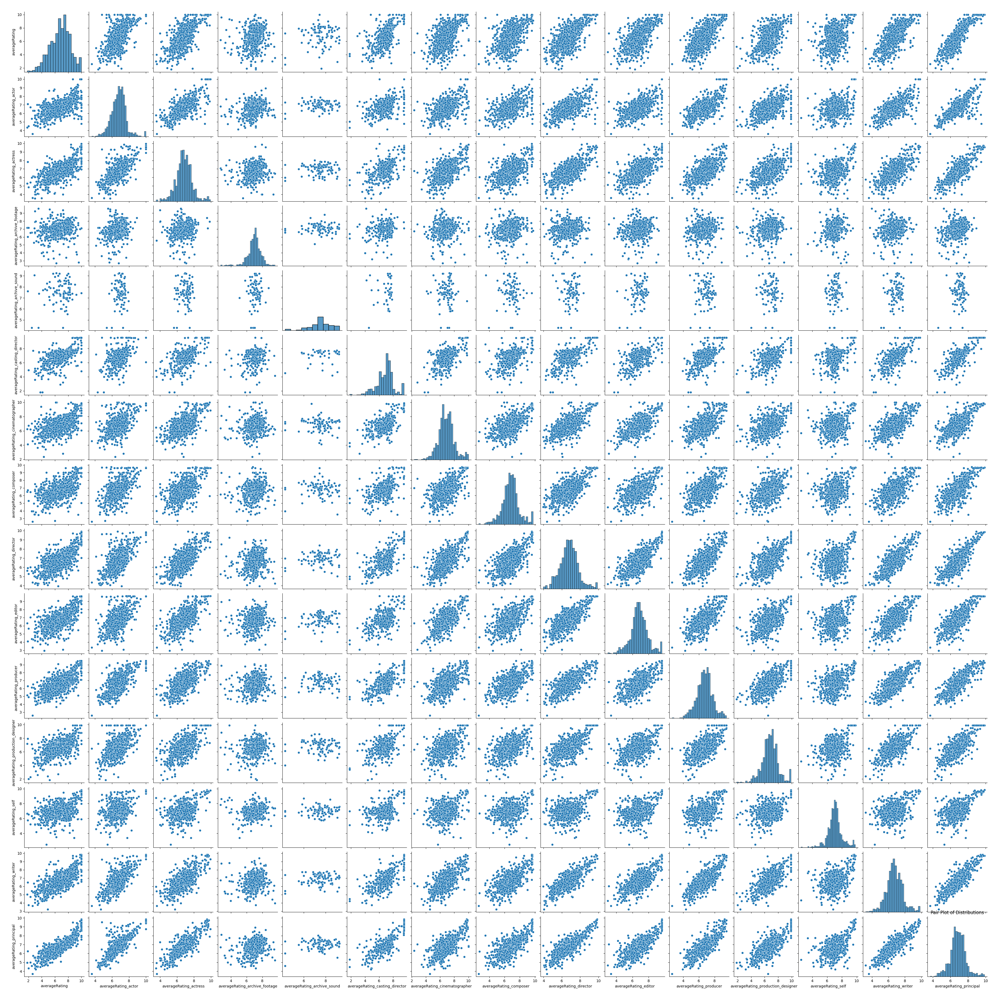
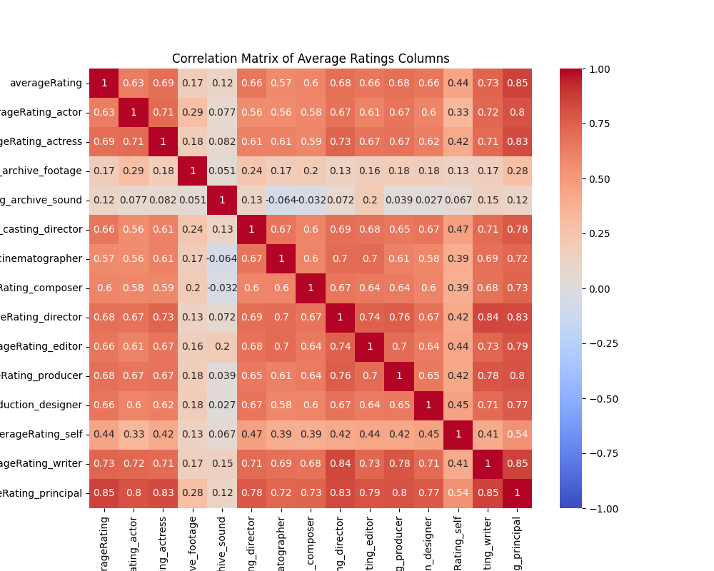

# IMDB Movie Cast and Crew Dataset
This dataset and corresponding notebook captures an analysis of cast and crew member IMDB ratings (averaged across all of their work) and correlation of the average of these ratings across production cast/crew with a title's IMDB rating.

## Motivation

The motivation for this dataset is to analyze the mean `averageRating` of each principal in IMDB (cast or crew member) across all of their accredited titles, along with the mean `averageRating` across all titles for specific roles ("category" in IMDB's parlance), such as actor, actress, writer, director, producer, and cinematographer. These attributes are then averaged over all cast and crew members for each title in IMDB's dataset. By producing these augmented versions of IMDB's non-commercial datasets, we can analyze the distributions of these scores across principals as well as evaluate correlations between these scores and the films' audience reception.

## Provenance

### Sources
The data was sourced and transformed from IMDB's non-commercial datasets.

https://datasets.imdbws.com/

### Methodology

The ratings data was aggregated across the principals data and attributed to the titles and names via the `tconst` and `nconst` identifiers. Pandas was used for the data transformation.

## Novelty of the Dataset

Past datasets and analyses have analyzed the effect size of cast star power on audience reception. This dataset uniquely computes the mean audience reception of each cast and crew member of a film aggregated across all of their films, and then computes the mean across all cast and crew members as well as for each specific category or role in the film's production.

## Power Analysis

The `power-analysis.py` script computes a required sample size of 668, accounting for the Bonferroni correction.

## Exporatory Data Analysis

In this section, I walk through exploratory data analysis of the generated `title.augmented.csv` dataset.

### Data completeness

There are 11,261,935 entries in this dataset (unique titles in IMDB).

Here are the columns and their completeness (1.0 means all rows have a value, 0.0 means none do).

```
tconst                               1.000000
titleType                            1.000000
primaryTitle                         0.999998
originalTitle                        0.999998
isAdult                              1.000000
startYear                            1.000000
endYear                              1.000000
runtimeMinutes                       1.000000
genres                               0.999944
averageRating                        0.133501
averageRating_actor                  0.655563
averageRating_actress                0.533825
averageRating_archive_footage        0.246011
averageRating_archive_sound          0.037062
averageRating_casting_director       0.098014
averageRating_cinematographer        0.240624
averageRating_composer               0.230728
averageRating_director               0.484630
averageRating_editor                 0.290368
averageRating_producer               0.456985
averageRating_production_designer    0.096627
averageRating_self                   0.568249
averageRating_writer                 0.553282
averageRating_principal              0.841646
```

### Filtering

There's significant missing data in the columns that I'm interested in, which are the `averageRating*` columns. Therefore, I first filter rows on presence of values of the following columns:

```
averageRating
averageRating_actor
averageRating_actress
averageRating_cinematographer
averageRating_composer
averageRating_director
averageRating_editor
averageRating_producer
averageRating_production_designer
averageRating_writer
averageRating_principal
```

### Sampling

We systematically sample using the `startYear` column and aim for a class balance across the first-listed genre of each title, aiming for about 1000 samples (satisfying the result of our power analysis). The unique values of the first-listed genre are 

```
['Documentary' 'Animation' 'Comedy' 'Short' 'Romance' 'News' 'Drama'
 'Fantasy' 'Horror' 'Biography' 'Music' 'Crime' 'Family' 'Adventure'
 'Action' 'History' '\\N' 'Mystery' 'Musical' 'War' 'Sci-Fi' 'Western'
 'Thriller' 'Sport' 'Film-Noir' 'Talk-Show' 'Game-Show' 'Adult'
 'Reality-TV' nan]
```

The samples per genre after sampling are:

```
Samples per top_genre:
             tconst
top_genre          
Action           35
Adult            35
Adventure        35
Animation        35
Biography        35
Comedy           35
Crime            35
Documentary      35
Drama            35
Family           35
Fantasy          35
Game-Show        35
History          36
Horror           35
Music            35
Musical          35
Mystery          35
News             39
Reality-TV       35
Romance          35
Sci-Fi           35
Short            35
Sport            63
Talk-Show        50
Thriller         35
War              50
Western          37
\N               35
```

### Distributions of the `averageRating*` attributes



### Correlation matrix



### Interpretation

In general, the average IMDB rating of a title is correlated with the average of ratings of all principals who were involved in the title's production. The rating of a title is most heavily correlated with the average IMDB rating of the title's writer(s) across all of their work, highlighting the importance of a strong screenplay as the foundation of any production.

## Scripts

This repository is comprised of the following scripts:
1. `data-engineering.py`: Generates the dataset
2. `power-analysis.py`: Performs power analysis using the T-Test for Independent Power
3. `exporatory-data-analysis.py`: Performs exploratory data analysis on the generated dataset

### Installation

#### Setting up a Python virtual environment

```
python -m venv .venv
```

Windows:

```
.venv/Scripts/activate
```

Mac/Linux:

```
source .venv/bin/activate
```

#### Installing requirements

```
pip install -r requirements.txt
```

### Running unit tests

```
pytest
```

### Running the scripts

#### `data_engineering.py`

```
python data_engineering.py
```

Note: due to the size of the datasets that are processed, you will need to run the script on a machine with sufficient RAM.
I ran the script on a Mac mini with 16GB of RAM.

#### `power_analysis.py`

```
python power_analysis.py
```

#### `exploratory_data_analysis.py`

```
python exploratory_data_analysis.py
```

## Ethical Considerations

### Consent and Transparency

I acknowledge that the data within this dataset was originally collected by IMDB. Users of this dataset should be aware that while IMDB has permitted educational use, individual consent for data inclusion may not have been explicitly obtained while collecting this data.

### Privacy

Ratings data is aggregated across IMDB users and therefore the dataset does not contain and personally identifiable information for IMDB end users. However, this data does contain personally identifiable information for members of the film industry.

### Fairness and Non-Discrimination

Users must be vigilant against potential biases in the dataset and avoid using the data in ways that could lead to discriminatory outcomes in research or applications.

### Usage Guidelines
1. Non-Commercial Use Only: This dataset must not be used for any commercial purposes, in accordance with the CC BY-NC-SA 4.0 license and IMDB's terms.
2. Attribution: Any use of this dataset must provide appropriate credit to IMDB as the original source of the data.
3. Share-Alike: If you adapt, transform, or build upon this material, you must distribute your contributions under the same CC BY-NC-SA 4.0 license.
4. Educational Purpose: Use of this dataset is restricted to educational assignments and academic research.

### Accountability and Responsibility

Users of this dataset are responsible for ensuring their use aligns with these ethical guidelines and the terms of the CC-BY-SA-NC 4.0 license. They should be prepared to address any ethical concerns that arise from their use of the data.

By using this dataset, you agree to adhere to these ethical principles and usage guidelines, contributing to responsible data practices in educational and research environments.

## License

This dataset is made available under the [CC BY-NC-SA 4.0 license](https://creativecommons.org/licenses/by-nc-sa/4.0/). The license's legal terms and conditions can be found in the LICENSE.txt file located in this repository.

## Kaggle

[Kaggle Dataset](https://www.kaggle.com/datasets/harannallasivanduke/imdb-cast-and-crew-mean-ratings-by-category/data)

## IMDB Data Usage Statement

Information courtesy of
IMDb
(https://www.imdb.com).
Used with permission.

Click [here](https://help.imdb.com/article/imdb/general-information/can-i-use-imdb-data-in-my-software/G5JTRESSHJBBHTGX) for more information on personal, non-commercial usage of IMDB's non-commercial datasets.
